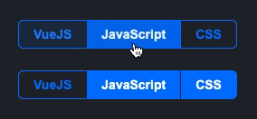

# vue-mzc-button-group
Simple Vue2 button group component



[Online demo](https://codesandbox.io/s/epic-jang-0j2tj?file=/src/App.vue)

## Installation
```sh
npm install vue-mzc-button-group --save
```

## Usage
```js
import VueMzcButtonGroup from "vue-mzc-button-group";
import "vue-mzc-button-group/src/vue-mzc-button-group.css";

export default {
  components: {
    VueMzcButtonGroup,
  },
  data() {
    return {
      oneSelected: 1,
      manySelected: [2, 3],
      options: [
        { id: 1, title: 'VueJS', value: 1, },
        { id: 2, title: 'JavaScript', value: 2, },
        { id: 3, title: 'CSS', value: 3, },
      ]
    };
  },
};
```
```html
<vue-mzc-button-group :options="options" v-model="oneSelected" />
<vue-mzc-button-group :options="options" multiple v-model="manySelected" />
```
## Customize
```css
.vue-mzc-button-group {
  --vue-mzc-button-group-padding: 16px;
  --vue-mzc-button-group-height: 32px;
  --vue-mzc-button-group-border-width: 1px;
  --vue-mzc-button-group-border-radius: 6px;
  --vue-mzc-button-group-primary-color: #0075ff;
  --vue-mzc-button-group-background-color: #ffffff;
}
```